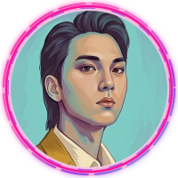

<!-- ════════════════════════════════════════════════════════════════════ -->
<!--                           HEADER BANNER                              -->
<!-- ════════════════════════════════════════════════════════════════════ -->

  

<!-- ════════════════════════════════════════════════════════════════════ -->
<!--                      AVATAR & TYPING SVG                             -->
<!-- ════════════════════════════════════════════════════════════════════ -->

  

  

<h2 align="center">NGUYEN DUC ANH TUAN</h2>
<h4 align="center">FRONTEND ENGINEER</h4>

<!-- Social Badges -->

  &nbsp;
  &nbsp;
  

<!-- Contact Info -->

  📧 <b>tuannguyen25101999@gmail.com</b>&nbsp;&nbsp;•&nbsp;&nbsp;📞 <b>(+84) 9172-701-00</b> 
  🔗 <a href="https://github.com/AnhhTuann"><b>github.com/AnhhTuann</b></a>

  

<!-- ════════════════════════════════════════════════════════════════════ -->
<!--                            FEATURED CV                               -->
<!-- ════════════════════════════════════════════════════════════════════ -->

<h2 align="center">
  &nbsp;My Resume
</h2>

  

<!-- ════════════════════════════════════════════════════════════════════ -->
<!--                             ABOUT ME                                 -->
<!-- ════════════════════════════════════════════════════════════════════ -->

<h2>
  &nbsp;About Me
</h2>

> **I am a Frontend Engineer with practical experience in designing and deploying web projects for diverse clients. I do not just write code, but I am also passionate about participating in the entire product creation journey, from translating ideas into designs to actual operation.**

-  I'm currently working as a **Freelance Frontend Developer**.
-  I specialize in building E-commerce and Landing Pages with **React, Vite, and custom WordPress themes**.
-  I have an aesthetic mindset, creating "Cinematic" and "Moody" styles using **SASS/SCSS**.
-  Fun fact: I actively integrate **AI models like Gemini** into my workflow to optimize code and debugging!

<!-- ════════════════════════════════════════════════════════════════════ -->
<!--                      PROFESSIONAL EXPERIENCE                         -->
<!-- ════════════════════════════════════════════════════════════════════ -->

<h2>
  &nbsp;Professional Experience
</h2>

### 💻 Freelance Frontend Developer

_2021 - Present_

- **End-to-End Web Development:** Directly set up and deploy websites from scratch using React, Vite, and specifically optimizing WordPress.
- **Aesthetic Mindset & SASS:** Utilize strengths in SASS/SCSS and an art background to build deep interfaces according to the unique requirements of each brand.
- **Clean Code & Performance:** Committed to writing clean, maintainable code using ESLint, Prettier, and version control via Git.
- **Applying AI to Workflow:** Integrate large language models (Gemini) to support debugging and source code optimization, shortening deployment time by 30%.

<!-- ════════════════════════════════════════════════════════════════════ -->
<!--                       TECH STACK & TOOLS                             -->
<!-- ════════════════════════════════════════════════════════════════════ -->

<h2>
  &nbsp;Tech Stack & Tools
</h2>

  

- **Frontend:** HTML5, CSS3, SASS/SCSS, Javascript (ES6+), TypeScript, React.js, Vite , Wordpress, PHP.
- **Backend:** NodeJS, GraphQL, MongoDB, MSSQL, MySQL, Neo4j, PostgreSQL.
- **Tools & AI:** Gemini, Github Copilot, Git, Docker , Figma , Vscode , Antigravity , Postgresql , Vercel,Neon ,Render.
- **Operating Systems:** Linux (Manjaro , Archlinux , Ubuntu), Windows.

<!-- ════════════════════════════════════════════════════════════════════ -->
<!--                       GITHUB ANALYTICS                               -->
<!-- ════════════════════════════════════════════════════════════════════ -->

<h2>
  &nbsp;GitHub Analytics
</h2>

  

 

  
  &nbsp;
  

 

  

<!-- ════════════════════════════════════════════════════════════════════ -->
<!--                            EDUCATION                                 -->
<!-- ════════════════════════════════════════════════════════════════════ -->

<h2>
  &nbsp;Education
</h2>

- 🏫 **Saigon University (SGU)** — _2017 – 2021_
  - Degree: **Information Technology Engineer** (Kỹ sư Công nghệ thông tin)
- 📝 **Certifications:** TOEIC (Score: 550)

<!-- ════════════════════════════════════════════════════════════════════ -->
<!--                              FOOTER                                  -->
<!-- ════════════════════════════════════════════════════════════════════ -->

  

© 2021 - 2026 NGUYEN DUC ANH TUAN. All Rights Reserved.

